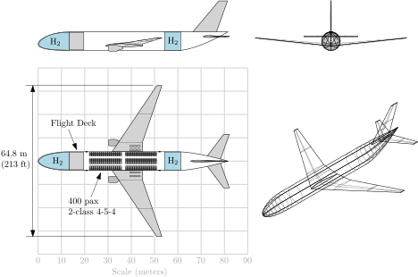
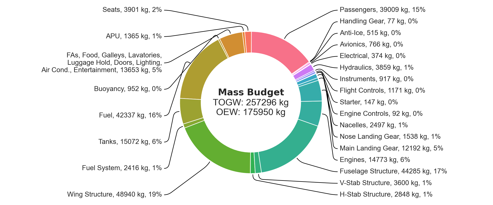

# Transport Aircraft

Models for commercial transport aircraft based on AeroSandbox.

Currently focuses on performance deltas between conventionally-fueled (kerosene) vs. liquid-hydrogen aircraft for long-haul transport.

## Optimized LH2 Aircraft

## Comparisons

|                  | Optimized LH2 Airplane | Optimized Kerosene Airplane | As-Built B777-300ER      |
|------------------|------------------------|-----------------------------|--------------------------|
| # of passengers  | 400                    | 400                         | 396                      |
| Ultimate range   | 7,500 nmi              | 7,500 nmi                   | 8,200 nmi (estimated)    |
| Cruise Mach      | 0.81                   | 0.82                        | 0.84                     |
| Cruise Altitude  | 40,800 ft              | 40,100 ft                   | 43,100 ft                |
| Gross weight     | 275,700   kg           | 314,500   kg                | 351,500 kg               |
| Empty weight     | 195,800   kg           | 164,900   kg                | 167,800 kg               |
| Fuel capacity    | 41,900 kg              | 110,600 kg                  | 145,500 kg               |
| Wing span        | 64.8 m                 | 64.8 m                      | 64.8 m                   |
| Length           | 81.5 m                 | 73.0 m                      | 73.9 m                   |
| Lift/Drag        | 17.1                   | 18.1                        | -                        |
| Fuel burn        | 7.54   g/pax-km        | 19.9   g/pax-km             | 19.4 to 26.1   g/pax-km  |
| Transport energy | 0.90   MJ/pax-km       | 0.86   MJ/pax-km            | 0.84 to 1.13   MJ/pax-km |

## Market Segmentation Impacts

#### Kerosene Aircraft Fleet

#### LH2 Aircraft Fleet

